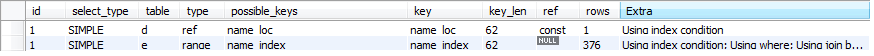

## 序号函数

### rank()

并列排序，会**跳过重复**序号

### dense_rank()

并列排序，**不会跳过重复**序号

### row_number()

顺序排序，不跳过任何一个序号，就是**行号**

`select` 
    `id,` 
    `name,` 
    `rank() over(order by score desc) rank,`
    `row_number() over(order by score desc) row_number,`
    `dense_rank() over(order by score desc) dense_rank`
`from students;`

`--------------------------------- 结果 ------------------------------------`
`+----+----------+-------+------+------------+------------+`
`| id | name     | score | rank | row_number | dense_rank |`
`+----+----------+-------+------+------------+------------+`
`|  1 | zhangsan |   100 |    1 |          1 |          1 |`
`|  3 | wangwu   |   100 |    1 |          2 |          1 |`
`|  2 | lisi     |    99 |    3 |          3 |          2 |`
`|  5 | pjf      |    99 |    3 |          4 |          2 |`
`|  6 | wzm      |    96 |    5 |          5 |          3 |`
`|  4 | trx      |    90 |    6 |          6 |          4 |`

## Mysql中的锁

| 锁     | 开销               | 加锁效率 | 死锁     | 锁定粒度           | 锁冲突概率 | 并发度 |
| ------ | ------------------ | -------- | -------- | ------------------ | ---------- | ------ |
| 表级锁 | 小                 | 快       | 不会出现 | 大                 | 最高       | 最低   |
| 行级锁 | 大                 | 慢       | 会出现   | 最小               | 最低       | 最高   |
| 页面锁 | 界于表锁和行锁之间 | -        | 会出现   | 界于表锁和行锁之间 | -          | 一般   |

## 优化MySQL顺序

最好是按照以下顺序优化：

1. SQL语句及索引的优化
2. 数据库表结构的优化
3. 系统配置的优化
4. 硬件的优化

### SQL语句优化举例

#### 1.where、order by 列上建立索引

对查询进行优化，应尽量避免全表扫描，首先应考虑在 where 及 order by 涉及的列上建立索引。

#### 2.避免在 where 中使用!=或<>操作符

应尽量避免在 where 子句中使用!=或<>操作符，否则将引擎放弃使用索引而进行全表扫描。

#### 3.避免在 where 中进行 null 值判断

应尽量避免在 where 子句中对字段进行 null 值判断，否则将导致引擎放弃使用索引而进行全表扫描，如：

select id from t where num is null

可以在num上设置默认值0，确保表中num列没有null值，然后这样查询：

select id from t where num=0

#### 4.避免在 where 中使用 or

应尽量避免在 where 子句中使用 or 来连接条件，否则将导致引擎放弃使用索引而进行全表扫描，如：

select id from t where num=10 or num=20

可以这样查询：

select id from t where num=10

union all

select id from t where num=20

#### 5.like注意事项

下面的查询也将导致全表扫描：

select id from t where name like '%abc%'

若要提高效率，可以考虑全文检索。

#### 6.慎用in 和 not in

in 和 not in 也要慎用，否则会导致全表扫描，如：

select id from t where num in(1,2,3)

对于连续的数值，能用 between 就不要用 in 了：

select id from t where num between 1 and 3

#### 7.避免在where 中使用参数

如果在 where 子句中使用参数，也会导致全表扫描。因为SQL只有在运行时才会解析局部变量，但优化程序不能将访问计划的选择推迟到运行时；它必须在编译时进行选择。然而，如果在编译时建立访问计划，变量的值还是未知的，因而无法作为索引选择的输入项。如下面语句将进行全表扫描：

select id from t where num=@num

可以改为强制查询使用索引：

select id from t with(index(索引名)) where num=@num

#### 8.避免在 where 中写表达式

应尽量避免在 where 子句中对字段进行表达式操作，这将导致引擎放弃使用索引而进行全表扫描。如：

select id from t where num/2=100

应改为:

select id from t where num=100*2

#### 9.避免在where中对使用函数

应尽量避免在where子句中对字段进行函数操作，这将导致引擎放弃使用索引而进行全表扫描。如：

select id from t where substring(name,1,3)='abc'--name以abc开头的id

select id from t where datediff(day,createdate,'2005-11-30')=0--'2005-11-30'生成的id

应改为:

select id from t where name like 'abc%'

select id from t where createdate>='2005-11-30' and createdate<'2005-12-1'

#### 10.NULL

不要在 where 子句中的“=”左边进行函数、算术运算或其他表达式运算，否则系统将可能无法正确使用索引。

#### 11.复合索引最左匹配原则

在使用索引字段作为条件时，如果该索引是复合索引，那么必须使用到该索引中的第一个字段作为条件时才能保证系统使用该索引，否则该索引将不会被使用，并且应尽可能的让字段顺序与索引顺序相一致。

#### 12.不要写一些没有意义的查询

不要写一些没有意义的查询，如需要生成一个空表结构：

select col1,col2 into #t from t where 1=0

这类代码不会返回任何结果集，但是会消耗系统资源的，应改成这样：

create table #t(...)

#### 13.用 exists 代替 in

很多时候用 exists 代替 in 是一个好的选择：

select num from a where num in(select num from b)

用下面的语句替换：

select num from a where exists(select 1 from b where num=a.num)

#### 14.索引列中不能有大量数据重复

并不是所有索引对查询都有效，SQL是根据表中数据来进行查询优化的，当索引列有大量数据重复时，SQL查询可能不会去利用索引，如一表中有字段sex，male、female几乎各一半，那么即使在sex上建了索引也对查询效率起不了作用。

#### 15.索引降低 insert 、 update 的效率

索引并不是越多越好，索引固然可以提高相应的 select 的效率，但同时也降低了 insert 及 update 的效率，因为 insert 或 update 时有可能会重建索引，所以怎样建索引需要慎重考虑，视具体情况而定。一个表的索引数最好不要超过6个，若太多则应考虑一些不常使用到的列上建的索引是否有必要。

#### 16.避免更新 clustered 索引数据列

应尽可能的避免更新 clustered 索引数据列，因为 clustered 索引数据列的顺序就是表记录的物理存储顺序，一旦该列值改变将导致整个表记录的顺序的调整，会耗费相当大的资源。若应用系统需要频繁更新 clustered 索引数据列，那么需要考虑是否应将该索引建为 clustered 索引。

#### 17.尽量使用数字型字段

尽量使用数字型字段，若只含数值信息的字段尽量不要设计为字符型，这会降低查询和连接的性能，并会增加存储开销。这是因为引擎在处理查询和连接时会逐个比较字符串中每一个字符，而对于数字型而言只需要比较一次就够了。

#### 18.尽可能的使用 varchar/nvarchar 代替 char/nchar 

尽可能的使用 varchar/nvarchar 代替 char/nchar ，因为首先变长字段存储空间小，可以节省存储空间，其次对于查询来说，在一个相对较小的字段内搜索效率显然要高些。

#### 19.用具体的字段列表代替“*”

任何地方都不要使用 select * from t ，用具体的字段列表代替“*”，不要返回用不到的任何字段。

#### 20.使用表变量来代替临时表

尽量使用表变量来代替临时表。如果表变量包含大量数据，请注意索引非常有限（只有主键索引）。

#### 21.避免频繁创建和删除临时表

避免频繁创建和删除临时表，以减少系统表资源的消耗。

#### 22.NULL

临时表并不是不可使用，适当地使用它们可以使某些例程更有效，例如，当需要重复引用大型表或常用表中的某个数据集时。但是，对于一次性事件，最好使用导出表。

#### 23.NULL

在新建**临时表**时，如果一次性插入数据量很大，那么可以使用 select into 代替 create table，避免造成大量 log ，以提高速度；如果数据量不大，为了缓和系统表的资源，应先create table，然后insert。

#### 24.NULL

如果使用到了临时表，在存储过程的最后务必将所有的临时表显式删除，先 truncate table ，然后 drop table ，这样可以避免系统表的较长时间锁定。

#### 25.避免使用游标

尽量避免使用游标，因为游标的效率较差，如果游标操作的数据超过1万行，那么就应该考虑改写。

#### 26.NULL

使用基于游标的方法或临时表方法之前，应先寻找基于集的解决方案来解决问题，基于集的方法通常更有效。

#### 27.NULL

与临时表一样，游标并不是不可使用。对小型数据集使用 FAST_FORWARD 游标通常要优于其他逐行处理方法，尤其是在必须引用几个表才能获得所需的数据时。在结果集中包括“合计”的例程通常要比使用游标执行的速度快。如果开发时间允许，基于游标的方法和基于集的方法都可以尝试一下，看哪一种方法的效果更好。

#### 28.NULL

在所有的存储过程和触发器的开始处设置 SET NOCOUNT ON ，在结束时设置 SET NOCOUNT OFF 。无需在执行存储过程和触发器的每个语句后向客户端发送 DONE_IN_PROC 消息。

#### 29.避免向客户端返回大数据量

尽量避免向客户端返回大数据量，若数据量过大，应该考虑相应需求是否合理。

#### 30.避免大事务操作

尽量避免大事务操作，提高系统并发能力。


## Mysql执行顺序

1. from 
2. on 
3. join 
4. where 
5. group by 
6. having 
7. select 
8. distinct 
9. union 
10. order by 

### 案例

存在如下表格orders：


注：下面所有语句符合语法顺序(也不可能不符合，因为会报错^_^)，只分析其执行顺序：(join和on属于多表查询，放在最后展示)

#### 语句一

select a.Customer 

from orders a 

where a.Customer='Bush' or a.Customer = 'Adams' 

分析一：首先是from语句找到表格，然后根据where得到符合条件的记录，最后select出需要的字段，结果如下：


#### 语句二groupby

groupby要和聚合函数一起使用

 

select a.Customer,sum(a.OrderPrice) 

from orders a 

where a.Customer='Bush' or a.Customer = 'Adams' 

group by a.Customer 

分析二：在from，where执行后，执行group by，同时也根据group by的字段，执行sum这个聚合函数。这样的话得到的记录对group by的字段来说是不重复的，结果如下：


 

#### 语句三having

 

select a.Customer,sum(a.OrderPrice) 

from orders a 

where a.Customer='Bush' or a.Customer = 'Adams' 

group by a.Customer 

having sum(a.OrderPrice) > 2000 

分析三：由于where是在group之前执行，那么如何对group by的结果进行筛选，就用到了having，结果如下：

 


#### 语句四distinct

（为测试，先把数据库中Adams那条记录的OrderPrice改为3000）

 

select distinct sum(a.OrderPrice) 

from orders a 

where a.Customer='Bush' or a.Customer = 'Adams' or a.Customer = 'Carter' 

group by a.Customer 

having sum(a.OrderPrice) > 1700 

分析四：将得到一条记录（没有distinct，将会是两条同样的记录）：

 


#### 语句五union

完全是对select的结果进行合并（默认去掉重复的记录）：

 

select distinct sum(a.OrderPrice) As Order1 

from orders a 

where a.Customer='Bush' or a.Customer = 'Adams' or a.Customer = 'Carter' 

group by a.Customer 

having sum(a.OrderPrice) > 1500 

union 

select distinct sum(a.OrderPrice) As Order1 

from orders a 

where a.Customer='Bush' or a.Customer = 'Adams' or a.Customer = 'Carter' 

group by a.Customer 

having sum(a.OrderPrice) > 2000 

分析五：默认去掉重复记录（想保留重复记录使用union all），结果如下：

 


#### 语句六order by

 

select distinct sum(a.OrderPrice) As order1 

from orders a 

where a.Customer='Bush' or a.Customer = 'Adams' or a.Customer = 'Carter' 

group by a.Customer 

having sum(a.OrderPrice) > 1500 

union 

select distinct sum(a.OrderPrice) As order1 

from orders a 

where a.Customer='Bush' or a.Customer = 'Adams' or a.Customer = 'Carter' 

group by a.Customer 

having sum(a.OrderPrice) > 2000 

order by order1 

分析：升序排序，结果如下：

 


#### 语句七limit


select distinct sum(a.OrderPrice) As order1 

from orders a 

where a.Customer='Bush' or a.Customer = 'Adams' or a.Customer = 'Carter' 

group by a.Customer 

having sum(a.OrderPrice) > 1500 

union 

select distinct sum(a.OrderPrice) As order1 

from orders a 

where a.Customer='Bush' or a.Customer = 'Adams' or a.Customer = 'Carter' 

group by a.Customer 

having sum(a.OrderPrice) > 2000 

order by order1 

limit 1 

分析七：取出结果中的前1条记录，结果如下：

 


#### 语句八

（上面基本讲完，下面是join 和 on)

select distinct sum(a.OrderPrice) As order1,sum(d.OrderPrice) As order2 

from orders a 

left join (select c.* from Orders c) d  

on a.O_Id = d.O_Id 

where a.Customer='Bush' or a.Customer = 'Adams' or a.Customer = 'Carter' 

group by a.Customer 

having sum(a.OrderPrice) > 1500 

union 

select distinct sum(a.OrderPrice) As order1,sum(e.OrderPrice) As order2 

from orders a 

left join (select c.* from Orders c) e  

on a.O_Id = e.O_Id 

where a.Customer='Bush' or a.Customer = 'Adams' or a.Customer = 'Carter' 

group by a.Customer 

having sum(a.OrderPrice) > 2000 

order by order1 

limit 1 

分析八：上述语句其实join on就是多连接了一张表，而且是两张一样的表，都是Orders。 执行过程是，在执行from关键字之后根据on指定的条件，把left join指定的表格数据附在from指定的表格后面，然后再执行where字句。


注：

1)使用distinct要写在所有要查询字段的前面，后面有几个字段，就代表修饰几个字段，而不是紧随distinct的字段；

2)group by执行后(有聚合函数)，group by后面的字段在结果中一定是唯一的，也就不需要针对这个字段用distinct；


## explain语法

在日常工作中，我们会有时会开慢查询去记录一些执行时间比较久的SQL语句，找出这些SQL语句并不意味着完事了，些时我们常常用到explain这个命令来查看一个这些SQL语句的执行计划，查看该SQL语句有没有使用上了索引，有没有做全表扫描，这都可以通过explain命令来查看。所以我们深入了解MySQL的基于开销的优化器，还可以获得很多可能被优化器考虑到的访问策略的细节，以及当运行SQL语句时哪种策略预计会被优化器采用。

```
-- 实际SQL，查找用户名为Jefabc的员工
select * from emp where name = 'Jefabc';
-- 查看SQL是否使用索引，前面加上explain即可
explain select * from emp where name = 'Jefabc';
```


expain出来的信息有10列，分别是id、select_type、table、type、possible_keys、key、key_len、ref、rows、Extra

**概要描述：**
id:选择标识符
select_type:表示查询的类型。
table:输出结果集的表
partitions:匹配的分区
type:表示表的连接类型
possible_keys:表示查询时，可能使用的索引
key:表示实际使用的索引
key_len:索引字段的长度
ref:列与索引的比较
rows:扫描出的行数(估算的行数)
filtered:按表条件过滤的行百分比
Extra:执行情况的描述和说明

**下面对这些字段出现的可能进行解释：**

### 一、 **id**

SELECT识别符。这是SELECT的查询序列号

 **我的理解是SQL执行的顺序的标识，SQL从大到小的执行**

\1. id相同时，执行顺序由上至下

\2. 如果是子查询，id的序号会递增，id值越大优先级越高，越先被执行

\3. id如果相同，可以认为是一组，从上往下顺序执行；在所有组中，id值越大，优先级越高，越先执行

```
-- 查看在研发部并且名字以Jef开头的员工，经典查询
explain select e.no, e.name from emp e left join dept d on e.dept_no = d.no where e.name like 'Jef%' and d.name = '研发部';
```



 

### **二、select_type**

 ***示查询中每个select子句的类型***

(1) SIMPLE(简单SELECT，不使用UNION或子查询等)

(2) PRIMARY(子查询中最外层查询，查询中若包含任何复杂的子部分，最外层的select被标记为PRIMARY)

(3) UNION(UNION中的第二个或后面的SELECT语句)

(4) DEPENDENT UNION(UNION中的第二个或后面的SELECT语句，取决于外面的查询)

(5) UNION RESULT(UNION的结果，union语句中第二个select开始后面所有select)

(6) SUBQUERY(子查询中的第一个SELECT，结果不依赖于外部查询)

(7) DEPENDENT SUBQUERY(子查询中的第一个SELECT，依赖于外部查询)

(8) DERIVED(派生表的SELECT, FROM子句的子查询)

(9) UNCACHEABLE SUBQUERY(一个子查询的结果不能被缓存，必须重新评估外链接的第一行)

 

### **三、table**

显示这一步所访问数据库中表名称（显示这一行的数据是关于哪张表的），有时不是真实的表名字，可能是简称，例如上面的e，d，也可能是第几步执行的结果的简称

 

### **四、type**

对表访问方式，表示MySQL在表中找到所需行的方式，又称“访问类型”。

常用的类型有： **ALL、index、range、 ref、eq_ref、const、system、****NULL（从左到右，性能从差到好）**

ALL：Full Table Scan， MySQL将遍历全表以找到匹配的行

index: Full Index Scan，index与ALL区别为index类型只遍历索引树

range:只检索给定范围的行，使用一个索引来选择行

ref: 表示上述表的连接匹配条件，即哪些列或常量被用于查找索引列上的值

eq_ref: 类似ref，区别就在使用的索引是唯一索引，对于每个索引键值，表中只有一条记录匹配，简单来说，就是多表连接中使用primary key或者 unique key作为关联条件

const、system: 当MySQL对查询某部分进行优化，并转换为一个常量时，使用这些类型访问。如将主键置于where列表中，MySQL就能将该查询转换为一个常量，system是const类型的特例，当查询的表只有一行的情况下，使用system

NULL: MySQL在优化过程中分解语句，执行时甚至不用访问表或索引，例如从一个索引列里选取最小值可以通过单独索引查找完成。

 

### **五、possible_keys**

指出MySQL能使用哪个索引在表中找到记录，查询涉及到的字段上若存在索引，则该索引将被列出，但不一定被查询使用（该查询可以利用的索引，如果没有任何索引显示 null）

该列完全独立于EXPLAIN输出所示的表的次序。这意味着在possible_keys中的某些键实际上不能按生成的表次序使用。
如果该列是NULL，则没有相关的索引。在这种情况下，可以通过检查WHERE子句看是否它引用某些列或适合索引的列来提高你的查询性能。如果是这样，创造一个适当的索引并且再次用EXPLAIN检查查询

 

### **六、Key**

key列显示MySQL实际决定使用的键（索引），必然包含在possible_keys中

如果没有选择索引，键是NULL。要想强制MySQL使用或忽视possible_keys列中的索引，在查询中使用FORCE INDEX、USE INDEX或者IGNORE INDEX。

 

### **七、key_len**

表示索引中使用的字节数，可通过该列计算查询中使用的索引的长度（key_len显示的值为索引字段的最大可能长度，并非实际使用长度，即key_len是根据表定义计算而得，不是通过表内检索出的）

不损失精确性的情况下，长度越短越好 

 

### **八、ref**

列与索引的比较，表示上述表的连接匹配条件，即哪些列或常量被用于查找索引列上的值

 

### **九、rows**

 估算出结果集行数，表示MySQL根据表统计信息及索引选用情况，估算的找到所需的记录所需要读取的行数

 

### **十、Extra**

该列包含MySQL解决查询的详细信息,有以下几种情况：

Using where:不用读取表中所有信息，仅通过索引就可以获取所需数据，这发生在对表的全部的请求列都是同一个索引的部分的时候，表示mysql服务器将在存储引擎检索行后再进行过滤

Using temporary：表示MySQL需要使用临时表来存储结果集，常见于排序和分组查询，常见 group by ; order by

Using filesort：当Query中包含 order by 操作，而且无法利用索引完成的排序操作称为“文件排序”

```
-- 测试Extra的filesort
explain select * from emp order by name;
```

Using join buffer：改值强调了在获取连接条件时没有使用索引，并且需要连接缓冲区来存储中间结果。如果出现了这个值，那应该注意，根据查询的具体情况可能需要添加索引来改进能。

Impossible where：这个值强调了where语句会导致没有符合条件的行（通过收集统计信息不可能存在结果）。

Select tables optimized away：这个值意味着仅通过使用索引，优化器可能仅从聚合函数结果中返回一行

No tables used：Query语句中使用from dual 或不含任何from子句

```
-- explain select now() from dual;
```

