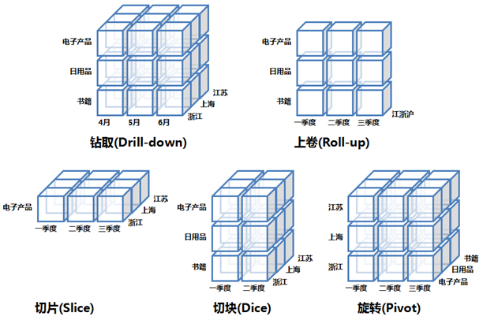

## MPP&分布式架构

### MPP 架构

#### 什么是 MPP？

MPP 架构是<u>传统数据仓库</u>中常见的技术架构，将单机数据库节点组成集群，从而提升处理性能。

集群中，这些节点间使用<u>非共享架构</u>，每个节点拥有独立的磁盘存储和内存系统，在计算过程中独立运行，而不必去关心整个集群的状态，也不关心其他节点存储的数据信息。

每台数据节点通过专用网络或者商业通用网络互相连接，在计算过程中，如果需要用到其他节点的数据，使用网络进行数据传输、协同计算。

需要注意的是，<u>MPP 集群是作为整体向外提供服务的，每台节点无法单独运行局部程序。</u>

#### 架构优点

MPP 集群的每台节点本质上还是数据库，所以在架构设计上：

1. 优先考虑 C（一致性）
2. 其次考虑 A（可靠性）
3. 尽量做好 P（分区容错性）

所以每台节点的内存管理方式、运算方式都比较精细，注重锁、事务、内外存交互等细节，从而保证数据一致性。在这种模式下，MPP 各个节点的运算延迟很低；但正因为精细的管理，其吞吐较差，在数据规模达到一定量级后，便成为局限性能的一个瓶颈。

所以 MPP 数据库更适合中等规模的结构化数据处理，性能上有很好的体现。

#### 架构缺点

但 MPP 因为非共享架构，所以其存储位置是不透明的；数据在存储时，通过 Hash 来确定物理节点。但在执行任务时，因无法断定数据的位置，所以查询任务会在所有节点执行。这个是架构所决定的，基本对性能没有影响。

<u>*MPP 真正的问题是扩展性*</u>，因为 MPP  在并行计算时，单节点瓶颈会成为整个系统的短板；在一个协同运算过程中，当一个节点运行缓慢时，其它节点便会进行等待。当然，缓慢节点可以通过网络将数据传输到其他节点来提升运行速度；但随着集群规模的增大，节点的故障率会逐渐升高，瓶颈就会越发明显。这也是为什么 MPP 数据库的扩展性较差的原因。

而且 MPP 一般致力实现分布式事务，但在分布式环境中实现事务后，扩展性一定会受到影响。

### 分布式架构

#### 什么是分布式架构？

分布式架构是大数据中常见的技术架构，也称为 Hadoop 架构/批处理架构。

分布式架构组成的集群中，各节点实现场地自治，即可以独立运行局部应用。而在 MPP 架构中是无法做到的，它只能作为一个整体对外提供服务。

因为分布式架构中，数据在集群中是全局透明共享的，每个节点拥有自治的运算资源。而各个节点的存储资源，组成了一个公共的数据存储系统；节点在进行运算时，可以访问公共的数据存储系统，实现数据的透明访问。

分布式架构中对网络的要求不高，每台节点可以通过局域网或广域网相连，因此节点间的通信开销比较大；在计算时，尽量避免数据移动。

#### 架构特点

分布式架构在设计时，优先考虑的是 P（分区容错性），然后是 A（可用性），最后再考虑 C（一致性）。

所以数据被拆分为多个分区后，每个分区又会有多个副本，从而保证容错。这样的话，就解决了单点故障的问题，如果一个节点运行缓慢，可以将节点上的任务取消，然后分发到数据的其它副本节点进行运算。

而且正因为分布式架构中数据一致性的优先级最低，所以它的存储、运算方式粗犷，吞吐量较大；也正是因为这样，在数据量较低的情况下，运行速度远不及 MPP 架构；但数据量一旦超过某个量级，吞吐量的优势会极大的发挥出来。

因为使用了公共的数据存储，所以它的扩展性极强，而且非常适合处理非结构化、半结构化数据。

这种粗犷的方式，非常适合海量数据的存储、处理。但它需要对中间结果进行存储，且数据移动开销较大。

### MPP+ 分布式架构

有些大数据数据仓库产品也会采用 MPP+ 分布式架构，融合两者的优点，来提升性能。

这种架构的数据存储层采用分布式架构中的公共存储，提升了分区容错性，也将 MPP 的扩展性得到了质的提升。上层处理架构依然采用 MPP，减少运算的延迟。

MPP+ 分布式架构的数据仓库相对于其它大数据产品来说，延迟低，速度快；所以在实时流处理场景中经常被采用。

### 小结

MPP 架构和分布式架构的适用场景不同。MPP 适合中等规模的数据处理，延迟低、SQL 支持高是它主要的优势；分布式（批处理）架构更适合海量数据规模的批处理计算，吞吐高、运算速度快、扩展性强是它的优势，而这也是离线批处理数仓所看重的。

MPP+ 分布式架构集成了两者的优势，扩展性强、延迟低、SQL 支持率高，实际上是两者间取了个折中，能够在海量数据规模下依然具有较好的低延迟特性。

这些架构并没有好坏之分，对于不同的场景只有适合和不适合之分。如果使用分布式架构的数据仓库对较少的数据量进行交互式的 SQL 查询，需要 5 分钟，但使用传统数仓只需要 1 秒；那不是产品的问题，而是用错的场景而已。

## 数仓主流架构

数据仓库在不同企业，它的架构也会有所差异。但分层和基本功能上大同小异，可能命名上有所不同，或者根据企业的业务特点做了一定的定制。

现在国内主流的架构还是以阿里为参考，整体架构如图所示：

从图中色块的不同，也能大体看到架构整体上分为四部分：ETL、ODS、CDM、ADS。

按照数据流动的方向，从下而上依次进行讲解。

### 简介

#### ETL

ETL 是数据同步模块，表示将数据从来源端经过抽取（extract）、交互转换（transform）、加载（load）至目的端的过程。

数据仓库因为要定期从业务数据库中同步数据，整个过程就是通过 ETL 来实现的。

ETL 一般会采用现成的工具，如 Sqoop、Kattle 等直接完成数据从数据库到数据仓库的加载工作。

有些企业除了需要收集业务数据库的数据，还会采集日志等文件数据，需要使用 Flume、Logstash 等工具，可能也会构建定制化的 ETL 系统。

对数据库数据的抽取，工作量较少，因为本身数据库中的数据就很规范。但对于非数据库中的数据，比如日志，数据较为杂乱，可能在抽取过程中要进行相当繁杂的数据清洗工作。

#### ODS（操作数据源层）

数据通过 ETL 流程抽取到数据仓库中后，会进入到 ODS 层。这一层与原始数据保持一致，不进行任何的修改，目的就是为了原始数据的保存。为业务数据库减负后，业务数据库会将历史数据删除，之后如果需要用到这部分数据，就只能从数据仓库的 ODS 层中进行寻找。

这里体现了数据仓库的非易失性，即不允许修改的特性。

#### CDM（公共维度模型层）

公共维度模型层主要是为了数据分析提供服务的。它又包含 DWD（数据明细层）、DWS（数据汇总层）。

##### DWD（数据明细层）

因为 ODS 层保留着原始数据，而来自不同数据源的原始数据格式不统一，无法进行直接的数据分析任务。所以要对这些数据进行清洗、标准化，剔除异常数据，统一编码、单位、字段描述等。处理之后的数据，存储到数据明细层 DWD 中进行保存。

##### DWS（数据汇总层）

数据仓库中的数据主要是满足数据分析的需要，所以要对数据按照主题进行汇总、聚合，满足对特定主题以及不同维度的分析。

但 DWD 层存储的数据依然是满足三范式的数据，且比较零散，所以要按照分析主题对数据汇总、聚合后，存储到 DWS（数据汇总层）中进行存储。DWS 层的数据已经脱离了三范式，大多以大宽表的形式存在。

因为数据分析会进行多维度的探索，所以这一层的数据为了提升数据分析的性能，会对数据进行建模，以模型的方式进行保存。数据仓库的模型设计也出现在这一层中。

#### ADS（数据应用层）

数据分析人员对 DWS（数据汇总层）的数据进行分析运算后，会将最终的结果表存储到 ADS 层中，这些数据需要提供以报表的形式提供给上层进行决策，或者直接提供给业务系统进行展示，所以一般 ADS 层直接对接报表系统、业务系统。

ADS 层是必要的，它可以进行单独的权限管控，是外部系统的数据结构，更加注重于其他系统的交互速度。但数据仓库一般更注重聚合、分析，所以 ADS 层一般会选择其他注重交互速度的系统，甚至传统数据库来搭建。

#### 小结

本节主要讲解了数据仓库的整体架构，包括 ETL、ODS、DWD、DWS、ADS。其中 ETL 完成了数据接入的功能，ODS  完成了历史数据积存功能，DWD、DWS、ADS 完成了数据分析功能。而 DWD、DWS 为数据分析提供服务，归在  CDM（公共维度模型层）中，ADS 用于存储结果数据，且对外部系统开发查询接口。

### ETL

#### ETL 基本概念

ETL 是将数据从来源端经过抽取（extract）、交互转换（transform）、加载（load）至目的端的过程。

ETL 过程是构建数据仓库的重要一环，用户从数据源抽取出所需的数据，经过数据清洗，最终按照预先定义好的数据仓库模型，将数据加载到数据仓库中去。ETL 规则的设计和实施约占整个数据仓库搭建工作量的 60%~80%。

#### 数据抽取（Extraction）

##### 对不同数据源的抽取

抽取的数据，根据类型的不同，可以分为结构化数据、非结构化数据、半结构化数据。

结构化数据的抽取可以采用 JDBC 连接到数据库直接进行抽取，这也是最常用的一种方法，但这种方式因为是对数据库进行直连，所以会消耗数据库的  IO，影响正常的业务进行，所以抽取时间会选择在凌晨业务量较少的时间；而且有一些企业不允许对数据库进行直接抽取，首先是出于安全的考虑，防止数据库异常、影响业务运行；其次对数据库进行直抽会因为 IO 的问题，导致抽取速度非常慢，无法在规定时间内完成数据导出。

除了使用 JDBC 进行数据抽取外，还可以抽取数据库日志的方式进行抽取，这种方式不会直连数据库，而是直接采集数据库的  WAL（预写日志文件）。数据库为了保证数据的安全性，所有对数据库的操作，都会顺序追加到 WAL 日志文件中，然后再对数据库执行操作。所以对  WAL 日志的采集对数据库的影响是极小的，但采集到的 WAL 日志需要经过解析后才能获取到数据，一般整个过程会使用工具来完成。

而对于非结构化、半结构化数据的抽取就比较简单了，只需要监控这些数据是否发生了变动，然后将变动后的数据进行抽取就行。

##### 数据抽取方式

数据抽取方式有全量同步、增量同步两种。

全量同步会将全部数据进行抽取，一般用于初始化数据装载。增量同步方式会检测数据的变动，抽取发生变动的数据，一般用于数据更新。

一般企业在第一次数据抽取时，采用全量同步，之后每天使用增量同步方式即可。但企业在数据量较小的时候，也会使用每天全量同步的方法同步数据。

#### 数据转换（Transformation）

对抽取来的数据，一般要经过数据转换的阶段，然后才可以被运送到数据仓库中。这个过程主要包含数据清洗、转换两个阶段。

数据清洗主要是对出现的重复、二义性、不完整、违反业务或逻辑规则等问题的数据进行统一的处理。

数据转换主要是对数据进行标准化处理，进行字段、数据类型、数据定义的转换。

对于结构化数据而言，在转换过程中的逻辑较为简单，因为结构化数据本身存储在数据库中，数据比较干净。而对于非|半结构化数据，转换的过程会较为复杂，因为这些数据本身就比较混乱，需要花费大量的工作在转换上。

#### 数据加载（Loading）

数据加载将处理完的数据，导入到对应的目标源中。完成数据的整个 ETL 阶段。此时数据就已经存储到数据仓库的 ODS 层中了。

#### 常见 ETL 产品

##### 结构化数据 ETL 工具

最常见的对结构化数据抽取的开源免费的 ETL 工具有 Sqoop、Kettle，其中 Sqoop 主要面向由<u>传统数据库的数据抽取到大数据集群的场景</u>，使用命令行操作；而 Kettle 是可视化窗口操作，<u>主要面向传统数据库、数据仓库</u>。

当然也有商业版如 Data stage、Informatica。

而且对于像 <u>Kafka 这样的消息中间件，也提供了对数据抽取的功能</u>。

##### 非/半结构化数据 ETL 工具

对于非/半结构化数据的 ETL 开源工具，Flume、Logstash 是比较主流的。而且它俩也提供对结构化数据的抽取，但非/半结构化数据场景是它们被使用最多的功能。

#### 小结

这节主要介绍了 ETL 的整体流程、常见 ETL 工具；在企业数仓设计中，这个阶段花费的时间最长，因为涉及到 ETL 工具选型、架构的搭建、数据的导入、数据稽查等。而且如果企业拥有海量数据，整个过程就更花费时间，可能需要几个月、或者半年的时间进行迁移。

### 操作数据层（ODS）

在数据仓库的整体架构中讲到，ODS 层的数据需与原业务数据保持一致，且不允许修改，从而完成历史数据积存的功能。

#### 数据管理

但在实际企业开发中，ODS 层的数据是原始数据的一个扩充集，在保留所有原始数据的情况下，会增加一些字段用来进行数据管理。

如下图所示，为表增加 update_time 字段标识数据进入数据仓库的时间，from 字段标识数据的源系统，update_type 字段标识数据的更新类型。

不过 ODS 层不是不允许数据修改吗？怎么会出现 update_type 属性呢？其实 ODS 层的数据在第一次进入数据仓库时，即通过  ETL 流程导入后，数据的 update_type 统一为 INSERT。但 ODS  层积存了历史数据后，业务系统会定期清理这些已经存储到数据仓库的历史数据，从而保证业务系统的性能；于是业务系统对历史数据低频率的查询、修改，就落到了数据仓库中，而 ODS 层不允许被修改，所以需要将修改的数据查询出来，修改后以追加的形式追加到 ODS 层中，此时这条追加数据的 update_type  就变为 UPDATE，标志着是后期被业务系统更改的数据。

#### 数据更新

在数据仓库中，业务数据定期会通过 ETL 流程导入到 ODS 中，导入方式有全量、增量两种。

数据第一次导入时，会选择全量导入。数据非第一次导入，每次只需要导入新增、修改的数据；新增的数据可以直接追加，但修改的数据如何进行判断？且大部分大数据数仓产品不允许修改操作，那如何让这部分增量数据得到更新？

当然，首先可以利用 update_type 字段，新增的数据先与数据仓库中的历史数据进行 join  连接，没有连接成功的一定为新增数据，连接成功的便是更新数据，然后将更新数据的 update_type 变为  UPDATE。但业务系统对近期数据的修改会比较频繁，这种方式会导致冗余数据过多。

还有一种方式，也是企业使用最多的方式，就是使用外连接 & 全覆盖的方式进行，即每日增量数据与数据仓库的历史数据做外连接，然后判断数据是新增或者修改，进行处理后，直接将原数据覆盖，保留与业务系统一致的数据。

### 数据明细层（DWD）

数据明细层对 ODS 层的数据除了进行清洗、标准化之外，还会进行维度退化。

维度是指对表中数据的一种组织方式，如时间、分类、地域；这些维度属性，在业务数据库中，会被拆分成多张表进行存储，这些表被称为维度表。

如下图所示，商品表和它的分类维度表（一、二、三级分类），按照范式标准一共拆分成了 4 张表。

但在数据仓库产品中，一旦涉及到 join 关联操作，会消耗大量的资源，且降低运行的速度。所以会选择增加冗余，将这些维度表合并到主表中形成宽表。这种操作被称为维度退化。

而且一些大型的企业，在全国各地都开设了分公司，每个分公司的业务数据库只记录当前地区的数据，于是虽然数据内容相同，但地域不同，就形成了多张表。这些数据被汇总起来的时候，也需要对地域维度进行维度退化，增加一个地域字段，如 City，然后将所有地区的表汇总成一张表，从而提升之后的运算性能。

### 数据汇总层（DWS）

数据汇总层的数据对数据明细层的数据，按照分析主题进行计算汇总，存放便于分析的宽表。

在汇总时，会进行大量的运算，如 join、聚合操作。最后存储的宽表并非 3NF，而是注重数据聚合，复杂查询、处理性能更优的数仓模型，如在传统数仓中的维度模型，在大数据数仓中的宽表模型。

数据汇总层（DWS）是数据仓库设计的核心，数据仓库的面向主题特性、模型设计都在这个层中进行，目的就是为数据分析提供更优异的性能。

### 数据应用层（ADS）

数据应用层也被称为数据集市，对数据汇总层的数据进行分析后，结果数据会提供给外部系统使用（报表系统、业务系统）；而数据仓库的使用场景是分析计算，外部系统更注重的是查询、交互速度，且让外部系统直接对接数据仓库，数仓的安全性、稳定性会降低，频繁的查询也会给数仓带来压力。

所以需要专用的 ADS 层来存储结果数据，并为外部系统提供访问接口，提供更快的查询、交互速度。一般而言，ADS 层会使用单独的数据产品，它注重的功能不同，所以也被称为数据集市，与数据仓库做区分。

ADS 可能会由多个产品组成，来满足业务系统要求的不同功能。如果是报表决策类的业务，一般使用 Kylin，提供更快的交互查询速度；如果业务系统要求对结果进行并发查询，则使用 HBase；如果需要更智能的搜索检索，则使用 ElasticSearch。

当然如果数据量较小，或者为了节省成本，也可以将结果数据导出到传统数据库中，如 MySQL，以提升整体的查询性能。

## 不同系统的建模方法

### 简介

#### OLTP 系统建模方法

OLTP 系统，即在线事务处理系统；企业的业务数据库就是属于 OLTP 范畴，它主要的操作是随机读写。

为了保证数据的一致性、减少冗余，经常使用关系模型。在关系模型中，使用三范式来减少冗余。

#### OLAP 系统建模方法

##### OLAP 系统概述

OLAP 系统，即在线联机分析系统，数据仓库就属于这一类。它主要操作是分析查询；关注数据整合，以及分析、处理性能。

但是三范式的设计，在分析查询中会导致大量的 join 关联操作，而在集群中的关联会导致处理性能下降（涉及到大量的数据移动）。所以 OLAP 一般采用反范式的设计，去增加冗余以提升整体运算性能。

OLAP 根据数据存储的方式不同，又分为 ROLAP 系统、MOLAP 系统、HOLAP 系统。

##### OLAP 系统分类

ROLAP（Relation OLAP，关系型 OLAP），数据以二维表形式存储；存储系统一般为 RDBMS，功能上更注重分析运算，所以会使用关系模型来提升分析性能。

MOLAP（Multidimensional OLAP，多维型  OLAP）：预先进行聚合计算，使用多维数组（矩阵）的形式保存数据结果，以空间换时间，加快查询分析时间。因为将查询的结果提前进行了计算，所以对于相同的查询、分析任务，可以直接返回结果，而不必进行等待。但预计算需要花费一定的时间，且需要一定的额外存储空间。

HOLAP（Hybrid OLAP，混合架构的 OLAP）：ROLAP 和 MOLAP 两者的集成；如低层是关系型的模型，高层是多维矩阵型的；查询效率高于 ROLAP，低于 MOLAP。

##### ROLAP 系统建模方法

一般而言，狭义上的数据仓库的建模方法就是指 ROLAP 系统中的建模。因为传统数据仓库中本质就是 RDBMS，而大数据数据仓库也是使用二维表的形式对数据进行组织。

典型的数据仓库的建模方法有 ER 模型、维度模型、Data Value、Anchor。它们的特点如下图所示。

其中 ER 模型是比较经典的一种数据仓库模型，它与 OLTP 系统的 ER 模型有所区分。而 Data Value、Anchor 模型则是 ER 模型的衍生。

但 ER 模型、DataValue、Anchor 模型不太适合互联网的快速构建与迭代的场景，而且构建成本也较高。

维度模型是最流行的数据仓库建模经典，也很贴合现在互联网企业的场景，适合快速构建数据仓库，并有较好的大规模复杂查询分析的性能。所以接下来我们主要去讲解维度建模。

##### MOLAP 系统建模方法

MOLAP 的建模方法，是 MOLAP 系统通过预计算，然后将结果保存为某种数据结构，这种数据结构称为模型。在不同的 MOLAP  系统中，它们的实现各不相同。比较经典和公认的模型是 Kylin 中的 Cube——数据立方体。之后会介绍 MOLAP 模型的内容。

#### 小结

本节主要讲解了 OLTP、OLAP 系统的异同，并且介绍了几种 ROLAP 的经典建模理论，简单提及了 MOLAP 系统建模。

MOLAP 和 ROLAP 的模型目的一致，就是为了加快分析、查询性能，只不过实现的方法不同而已，导致其侧重、适用场景也不同。

ROLAP 主要是为了解决原始数据的三范式对分析计算性能带来的问题，保留原始数据，更为灵活，保证大批量分析任务的运算效率。所以它更多出现在 DWS 层，作为跑批任务的性能支柱。

而 MOLAP 主要是为了解决对数据的多维度快速分析，更适用于业务系统、报表工具对结果表的分析查询，一般不保留原始数据，不太灵活。所以它更多出现在 ADS 层，作为其他系统的查询接口。

### ROLAP 维度模型

在数据仓库的 ROLAP 模型中，维度模型是被使用最多、最经典的一种模型。能够提高数据仓库的分析计算性能。

在维度模型中，表被分为维度表、事实表，维度表围绕事实表进行解释。

其中事实表是一张表的基本数据，而维度表则是对数据的一种组织方式，常用于不同维度对数据进行组织。如图所示，商品表为事实表，而分类表则是维度表。

在实际生活中，按照维度去对数据进行筛查是非常常见的一种手段。如在购物网站购买手机时，可以按照品牌、CPU 型号、屏幕尺寸等条件对手机进行删选。筛选条件就是维度，而筛选出来的手机数据就是事实。

一般常见的维度类型有：分类、时间、地域等。

在维度模型中，根据维度的排布又分为星型模型、雪花模型、星座模型。模型建立后，方便对数据进行多维分析。

如下图所示，可以统计当前城市每年的空气质量情况、每月的空气质量、每天的空气质量，从而在时间维度上完成不同粒度的快速分析任务。

#### 星型模型

标准的星型模型维度只有一层，分析性能最优

中间为事实表，然后通过 key 值的记录来关联其他维度表。

#### 雪花模型

雪花模型具有多层维度，比较接近三范式设计，较为灵活，但牺牲掉了部分分析性能。

#### 星座模型

星座模型基于多个事实表，事实表之间会共享一些维度表。这是大型数据仓库中的常态，是业务增长的结果，与模型设计无关。

因为无论模型是星型还是雪花，在业务规模逐渐增长的情况下，都会出现维度共用，从而形成星座模型。

‘

#### 宽表模型

无论是 ER、Data Value、Anchor  还是刚刚讲的维度模型，这些都是较为经典的数仓模型理论。数仓的出现较早，开始时都是使用高配数据库或者 MPP  来构建的，所以这些模型依托于单机或集群数据库，分析性能表现优秀。但是在大数据的数仓中，表现却不那么好；因为处理模式不同，大数据的数仓不适合大量  join，所以多表的拆分对其性能的发挥有较大的影响。

所以就需要对经典模型进行改造和衍生，那宽表模型就是维度模型的衍生。它将维度表冗余到事实表中，形成宽表，以减少 join 操作，所以适合 join 性能不佳的数据仓库产品。

所以，理论在运用到具体实践中的时候，一定要贴合相应的产品性能、场景做出一定的调整，灵活运用。

#### 小结

本节主要讲了 ROLAP  模型中的经典——维度建模。这也是传统数据仓库中使用最多的一种模型。维度模型将表分为事实表、维度表，根据它们排布组合的不同，形成星型模型、雪花模型、星座模型三种。星型模型性能好，雪花模型较为灵活，而大型数据仓库中星座模型是常态。但在大数据数据仓库这里，维度模型做了进一步的衍生、妥协，合并成为宽表，以减少数据移动产生的代价。

### MOLAP 建模方法

#### 建模原理

MOLAP 是一种用空间换时间的方式。既然 OLAP  的特点是满足快速的复杂分析查询，而它对性能的影响主要体现在多种维度的组合、聚合上。所以，与其查询的时候进行计算，不如直接将结果预先计算出来，然后进行存储，这样便可以对之后的查询性能带来极大的提升。但这样也损失了灵活性，并需要大量的空间用于存储。

那这种预计算结果以什么形式存储呢？Cube 模型。

#### Cube 模型

Cube 模型是以多维数组的方式，物化到存储系统中，加快后续的查询。

它是一个数据立方体，类似魔方的形状。

它的使用方法也类似于魔方一样，不管从哪个维度查询都很快，而且查询时各个维度可以灵活进行组合。因为提前做好了聚合运算，所以性能上非常优秀。

但生成 CUBE 需要大量的时间、空间。维度的预处理也可能会导致数据的膨胀。

#### 常见 MOLAP 产品

常见的 MOLAP 产品有 Kylin、Druid。

其中 Druid 是时序数据库，有它特定的应用场景。Kylin 的场景较为通用，是 MOLAP 开源产品的代表。

Kylin 从不同数据源读取数据后，通过 Cube 构建引擎形成 Cube 模型，然后物化存储到 HBase 中进行存储。而 HBase 本身是 NoSQL 数据库，且并发读取性能优秀，可以支撑快速查询的任务。

Kylin 因为只存储 Cube 模型，不存储原始数据，所以它适用场景是 ADS 层，作为数据查询接口。一般 MOLAP 不作为 DWS 层的模型，也是因为这个原因。

#### 小结

本节主要介绍了 MOLAP 建模方法，其实关键在预计算，之后存储为 Cube 这种数据结构；然后简单介绍了 Kylin 的基本原理。一般 ROLAP、MOLAP 模型都会在数据仓库中出现，共同为数据分析的不同阶段服务。

### 多维分析

#### OLAP 多维分析

OLAP 主要操作是复杂查询，可以多表关联，使用 COUNT、SUM、AVG 等聚合函数。对于这些复杂查询操作，OLAP 做了直观的定义和分类，将其称为多维分析；其中包括钻取、切片、切块、旋转。

#### 钻取

钻取是对维度不同层次的分析，通过改变维度的层次来变换分析的粒度，包括上卷（Roll-up）、下钻（Drill-down）。

上卷（Roll-up），也称为向上钻取，指从低层次到高层次的切换。

如图所示，即在查询时，初始条件是驱蚊剂、防晒设备、急救用品，这些都是属于户外防护用品的子集，之后直接查询所有的户外防护用品，称为上卷；维度升到了一个更高的层次。

下钻（Drill-down），指从高层次到低层次的切换。

同理，初始条件是户外防护用品，之后细分为驱蚊剂、防晒设备、急救用品，这种操作称为下钻；维度降了一个层次。

#### 切片（Slice）、切块（Dice）

选择某个维度进行分割，称为切片。

如图所示，数据中包含的时间维度有 2004、2005、2006 三个，单独对 2004 这个维度进行查询，称为切片。

按照多维进行的切片称为切块。

如图所示，如果对时间维度中的 2004 进行切片后，再对登山设备进行切片，称为切块。

#### 旋转（Pivot）

旋转是指对维度方向的互换，类似于交换坐标轴上卷（Roll-up）。

旋转在查询中是指交换维度；如图所示，初始条件是先查询产品类型，然后再对时间进行筛选，对维度进行旋转后可变为先对时间进行筛选，然后再查询产品类型。

#### 小结

这节讲了 OLAP 的多维分析，其实就是将复杂查询做了归类，务必掌握这些专业术语的基本含义。

## 构建企业级数据仓库五步法

### 一、 确定主题

即确定数据分析或前端展现的主题(例:某年某月某地区的啤酒销售情况)。主题要体现出某一方面的各分析角度(维度)和统计数值型数据(量度)之间的关系,确定主题时要综合考虑.

### 二、 确定量度

确定主题后，需要考虑分析的技术指标(例:年销售额等等)。它们一般为数据值型数据，其中有些度量值不可以汇总；些可以汇总起来，以便为分析者提供有用的信息。量度是要统计的指标，必须事先选择恰当，基于不同的量度可以进行复杂关键性指标(KPI)的设计和计算。

### 三、 确定事实数据粒度

确定量度之后，需要考虑该量度的汇总情况和不同维度下量度的聚合情况.例如在业务系统中数据最小记录到秒，而在将来分析需求中，时间只要精确到天就可以了，在ETL处理过程中，按天来汇总数据,些时数据仓库中量度的粒度就是”天”。如果不能确认将来的分析需求中是否要精确的秒，那么，我们要遵循”最小粒度原则”,在数据仓库中的事实表中保留每一秒的数据，从而在后续建立多维分析模型(CUBE)的时候,会对数据提前进行汇总，保障产生分析结果的效率。

### 四、 确定维度

维度是分析的各个角度.例:我们希望按照时间，或者按照地区，或者按照产品进行分析。那么这里的时间，地区，产品就是相应的维度。基于不同的维度，可以看到各个量度汇总的情况，也可以基于所有的维度进行交叉分析。

维度的层次(Hierarchy)和级别(Level)。例:在时间维度上，按照”度-季度-月”形成了一个层次，其中”年” ,”季度”  ,”月”成为了这个层次的3个级别。我们可以将“产品大类-产品子类-产品”划为一个层次，其中包含“产品大类”、“产品子类”、“产品”三个级别。

我们可以将3个级别设置成一张数据表中的3个字段,比如时间维度；我们也可以使用三张表，分别保存产品大类，产品子类，产品三部分数据,比如产品维度。

建立维度表时要充分使用代理键.代理键是数据值型的ID号码(每张表的第一个字段)，它唯一标识了第一维度成员。在聚合时，数值型字段的匹配和比较，join效率高。同时代理键在缓慢变化维中，起到了对[新数据](https://www.baidu.com/s?wd=新数据&tn=24004469_oem_dg&rsv_dl=gh_pl_sl_csd)与历史数据的标识作用。

### 五、 创建事实表

在确定好事实数据和维度后，将考虑加载事实表。业务系统的的一笔笔生产，交易记录就是将要建立的事实表的原始数据.

我们的做法是将原始表与维度表进行关联，生成事实表。关联时有为空的数据时(数据源脏)，需要使用外连接，连接后将各维度的代理键取出放于事实表中，事实表除了各维度代理键外，还有各度量数据，不应该存在描述性信息。

事实表中的记录条数据都比较多，要为其设置复合主键各蛇引，以实现数据的完整性和基于数据仓库的查询性能优化。

## 元数据

描述数据及其环境的数据。两方面用途:

首先,元数据能提供基于用户的信息,如记录数据项的业务描述信息的元数据能帮助用户使用数据。

其次,元数据能支持系统对数据的管理和维护,如关于数据项存储方法的元数据能支持系统以最有效的方式访问数据。

元数据机制主要支持以下五类系统管理功能:

（１）描述哪些数据在数据仓库中；

（２）定义要进入数据仓库中的数据和从数据仓库中产生的数据；

（３）记录根据业务事件发生而随之进行的数据抽取工作时间安排；

（４）记录并检测系统数据一致性的要求和执行情况；

（５）衡量数据质量。

## 事实表

事实表是包含大量数据值的一种结构。事实数据表可能代表某次银行交易,包含一个顾客的来访次数，并且这些数字信息可以汇总，以提供给有关单位作为历史的数据。

每个数据仓库都包含一个或者多个事实数据表。事实数据表只能包含数字度量字段和使事实表与维度表中对应项的相关索引字段.，该索引包含作为外键的所有相关性维度表的主键。

事实数据表中的“度量值”有两中：一种是可以累计的度量值，另一种是非累计的度量值。用户可以通过累计度量值获得汇总信息。

## 维度表

用来描述事实表的某个重要方面，维度表中包含事实表中事实记录的特性：有些特性提供描述性信息，有些特性指定如何汇总事实数据表数据，以便为分析者提供有用的信息，维度表包含帮助汇总数据的特性的层次结构

### 缓慢变化维

在实际情况下，维度的属性并不是静态的，它会随着时间的流失发生缓慢的变化。

处理方法: 1新信息直接覆盖旧信息，2,保存多条记录，并添加字段加以区分（用y,n;0,1,2或用时间来区别新旧记录）

3.保存多条记录，并添加字段加以区分4.另外建表保存历史记录.5混合模式

### 退化维

一般来说事实表中的外键都对应一个维表，维的信息主要存放在维表中。但是退化维仅仅是事实表中的一列，这个维的相关信息都在这一列中，没有维表与之相关联。比如：发票号，序列号等等。 
那么退化维有什么作用呢？ 
1、退化维具有普通维的各种操作，比如：上卷，切片，切块等

(上卷汇总，下钻明细；切片，切块:对二维数据进行切片，三维数据进行切块,,可得到所需要的数据) 
2、如果存在退化维，那么在ETL的过程将会变得容易。 
3、它可以让group by等操作变得更快

## E T L

extract/transformation/load寻找数据，整合数据，并将它们装入数据仓库的过程。

ETL是将业务系统的数据经过抽取、清洗转换之后加载到数据仓库的过程，目的是将企业中的分散、零乱、标准不统一的数据整合到一起，为企业的决策提供分析的依据。

工作流 抽取à清洗,转换à加载 数据流 业务系统àODSà数据仓库

### 抽取

方法有三种:1.利用工具,例如datastage，informatic，OWB，DTS，SISS. 2，利用存储过程. 3,前两种工具结合.

抽取前的调研准备工作:1.弄清数据是从哪几个业务系统中来，各个业务系统的数据库服务器运行什么DBMS. 2.是否存在手工数据，手工数据量有多大。3.是否存在非结构化的数据。

#### 抽取中的数据处理方法

1. 业务系统服务器与DW的DBMS相同时，在DW数据仓库服务器与原业条系统之间建立直接的链接关系就可以写select语句直接访问.
2. 业务系统服务器与DW的DBMS不同时,对不能建立直接链接的话，可以将源数据导入.txt文件，在导入ODS中,或通过程序接口来完成.
3. 对于文件类型数据源(.txt.xls)利用数据库工程将这个数据导入指定的数据库，如(oracle的SQL*LOADER,db2的import)

#### 如何实现增量抽取

业务系统会记录业务发生的时间，我们可以用来做增量的标志,每次抽取之前首先判断ODS中记录最大的时间，然后根据这个时间去业务系统取大于这个时间所有的记录。

### 清洗

数据清洗的任务是过滤那些不符合要求的数据，将过滤的结果交给业务主管部门，确认是否过滤掉还是由业务单位修正之后再进行抽取。

清洗的数据种类: 1,不完整数据，2,错误数据，3重复的数据.

### 转换

1.不一致数据转换:编码转换(m,f;男女);字段转换(balance,bal);度量单位的转换(cm,m)

2.数据粒度的转换;业务系统数据存储非常明细的数据，而数据仓库中数据是用分析的，不需要非常明细，会将业务系统数据按照数据仓库粒度进行聚合.

3.商务规则的计算.不同企业有不同的业务规则，不同的数据指标,在ETL过程，将这些数据计算好之后存储在数据仓库中，供分析使用(比如KPI)

## 数据模型

### 维度建模（dimensional modeling）

是数据仓库建设中的一种数据建模方法。按照事实表，维表来构建数据仓库，数据集市。这种方法最被人广泛知晓的名字就是星型模式（Star-schema）。

### 星形模型与雪花模型的区别？

#### 星型模型

星型模型：是一种非正规化的结构，多维数据集的每一个维度都直接与事实表相来连接，不存在渐变维度，所以数据有一定的冗余。

比如：销售数据仓库中的星型模型

#### 雪花模型

雪花模型：当有一个或多个维度表没有直接连接到事实表上，而是通过其他维度表连接到事实表上时，其图解就像多个雪花连接在一起，故称雪花模型。雪花模型去除了数据冗余。
 比如：销售数据仓库中的雪花模型

#### 比较

1）星型模型因为数据的冗余所以很多统计查询不需要做外部的连接，因此一般情况下**效率**比雪花模型要高。
 2）星型模型不用考虑很多正规化的因素，设计和实现都比较**简单**。
 3）雪花模型由于**去除了冗余**，有些统计就需要通过表的连接才能产生，所以效率不一定有星型模型高。
 4）正规化也是一种比较复杂的过程，相应的数据库结构设计、数据的ETL、以及后期的维护都要复杂一些。因此在冗余可以接受的前提下，实际运用中星型模型使用更多，也更有效率。

星型模型和雪花模型的优劣对比：

### 替代键（alternate key）

可以是数据表内不作为主键的其他任何列，只要该键对该数据表唯一即可。换句话说，在唯一列内不允许出现数据重复的现象。

数据仓库项目最重要或需要注意的是什么，以及如何处理？

数据质量，主要是数据源数据质量分析，数据清洗转换，当然也可以定量分析

数据仓库有两个重要目的,一是数据集成,二是服务BI 
数据准确性是数据仓库的基本要求,而效率是项目事实的前提,数据质量、运行效率和扩展性是数据仓库项目设计、实施高明与否的三大标志;

### 代理键

在关系型数据库设计中，是在当资料表中的候选键都不适合当主键时，例如资料太长，或是意义层面太多，就会用一个attribute来当代理主键，此主键可能是用流水号，来代替可辨识唯一值的主键

在数据仓库领域有一个概念叫Surrogate key，中文一般翻译为“代理关键字”。代理关键字一般是指维度表中使用顺序分配的整数值作为主键，也称为“代理键”。代理关键字用于维度表和事实表的连接。可以避免通过主键的值就可以了解一些业务信息

## 参考资料

| 来源               | 网址                                               |
| ------------------ | -------------------------------------------------- |
| 数据仓库原理与实战 | https://www.cnblogs.com/Dominic-Ji/p/13796578.html |
|                    |                                                    |
|                    |                                                    |

