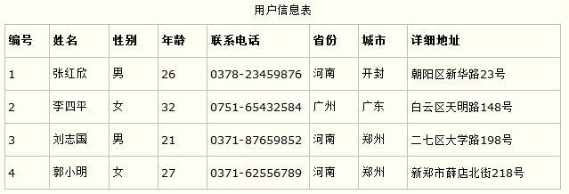
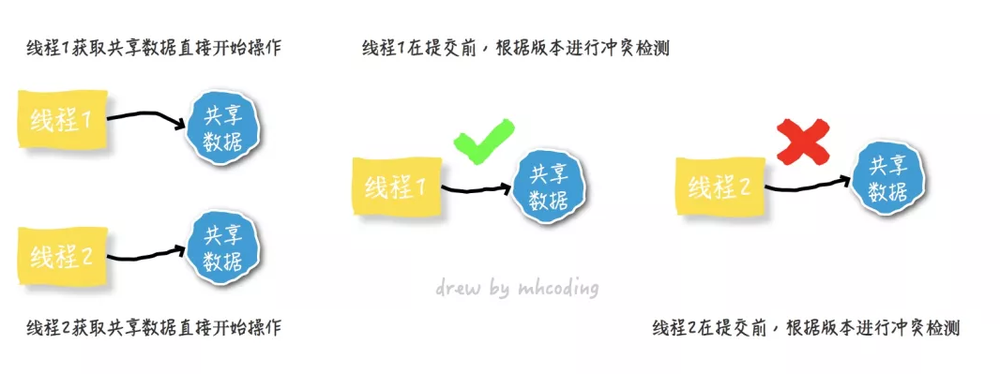

## 数据库范式

### 第一范式

**(确保每列保持原子性)**

第一范式是最基本的范式。如果数据库表中的所有字段值都是不可分解的原子值，就说明该数据库表满足了第一范式。

第一范式的合理遵循需要根据系统的实际需求来定。比如某些数据库系统中需要用到“地址”这个属性，本来直接将“地址”属性设计成一个数据库表的字段就行。但是如果系统经常会访问“地址”属性中的“城市”部分，那么就非要将“地址”这个属性重新拆分为省份、城市、详细地址等多个部分进行存储，这样在对地址中某一部分操作的时候将非常方便。这样设计才算满足了数据库的第一范式，如下表所示。



上表所示的用户信息遵循了第一范式的要求，这样在对用户使用城市进行分类的时候就非常方便，也提高了数据库的性能。

​         

### 第二范式

**(确保表中的每列都和主键相关，主要针对联合主键而言)**

第二范式在第一范式的基础之上更进一层。第二范式需要确保数据库表中的每一列都和主键相关，而不能只与主键的某一部分相关。也就是说在一个数据库表中，一个表中只能保存一种数据，不可以把多种数据保存在同一张数据库表中。

比如要设计一个订单信息表，因为订单中可能会有多种商品，所以要将订单编号和商品编号作为数据库表的联合主键，如下表所示。

 订单信息表


这样就产生一个问题：这个表中是以订单编号和商品编号作为联合主键。这样在该表中商品名称、单位、商品价格等信息不与该表的主键相关，而仅仅是与商品编号相关。所以在这里违反了第二范式的设计原则。

而如果把这个订单信息表进行拆分，把商品信息分离到另一个表中，把订单项目表也分离到另一个表中，就非常完美了。如下所示。


这样设计，在很大程度上减小了数据库的冗余。如果要获取订单的商品信息，使用商品编号到商品信息表中查询即可。

​         

### 第三范式

**(确保每列都和主键列直接相关,而不是间接相关)**

第三范式需要确保数据表中的每一列数据都和主键直接相关，而不能间接相关。

比如在设计一个订单数据表的时候，可以将客户编号作为一个外键和订单表建立相应的关系。而不可以在订单表中添加关于客户其它信息（比如姓名、所属公司等）的字段。如下面这两个表所示的设计就是一个满足第三范式的数据库表。


这样在查询订单信息的时候，就可以使用客户编号来引用客户信息表中的记录，也不必在订单信息表中多次输入客户信息的内容，减小了数据冗余。

## 事务的四大特性

### 原子性（Atomicity）

　　原子性是指事务包含的所有操作要么全部成功，要么全部失败回滚。

　　事务的操作如果成功就必须要完全应用到数据库，如果操作失败则不能对数据库有任何影响。

#### 如何保证原子性

**主要靠undolog来实现**

```sql
begin; -- 开始一个事务
update table set A = A - 1亿; -- 伪sql，仅作示意
update table set B = B + 1亿;
-- 其他读写操作
commit; -- 提交事务
```

要保证上面操作的原子性， 就得等`begin`和`commit`之间的操作全部成功完成后，才将结果统一提交给数据库保存，如果途中任意一个操作失败，就撤销前面的操作，且操作不会提交数据库保存,这样就保证了`同生共死`。

### 一致性（Consistency）

　　一致性是指事务必须使数据库从一个一致性状态变换到另一个一致性状态，也就是说一个**事务执行之前和执行之后都必须处于一致性状态**。

　　拿转账来说，假设用户A和用户B两者的钱加起来一共是5000，那么不管A和B之间如何转账，转几次账，事务结束后两个用户的钱相加起来应该还得是5000，这就是事务的一致性。

#### 事务日志

数据库通过事务日志来达到这个目标。 事务的每一个操作（增/删/改）产生一条日志，内容组成大概如下：

- LSN：一个按时间顺序分配的唯一日志序列号，靠后的操作的LSN比靠前的大。
- TransID：产生操作的事务ID。
- PageID：被修改的数据在磁盘上的位置，数据以页为单位存储。
- PrevLSN：同一个事务产生的上一条日志记录的指针。
- UNDO：取消本次操作的方法，按照此方法回滚。
- REDO：重复本次操作的方法，如有必要，重复此方法保证操作成功。


 来自jobbole.com

磁盘上每个页（保存数据的，不是保存日志的）都记录着最后一个修改该数据操作的LSN。数据库会通过解析事务日志，将修改真正落到磁盘上(写盘)，随后清理事务日志(正常情况下)。

这也是数据库在保证`数据安全`和`性能`这两个点之前的折中办法：

- 如果每次更新都写盘，由于数据是随机的，会造成大量的随机IO，性能会非常差
- 如果每次更新不马上写盘，那一旦数据库崩溃，数据就会丢失

折中的办法就是：

- 将数据的变更以事务日志的方式，按照时间先后追加到日志缓冲区，由特定算法写入事务日志，这是顺序IO，性能较好
- 通过数据管理器解析事务日志，由特定的算法择机进行写盘

#### 数据库恢复

当数据库从崩溃中恢复时，会有以下几个步骤：

- 解析存在的事务日志，分析哪些事务需要回滚，哪些需要写盘(还没来得及写盘，数据库就崩溃了)。
- Redo，进行写盘。检测对应数据所在数据页的LSN，如果数据页的LSN>=事务操作的LSN，说明已经写过盘，不然进行写盘操作。
- Undo, 按照LSN倒序进行回滚

经过这几个阶段，在数据库恢复后，可以达到奔溃前的状态，也保证了数据的一致性。

### 隔离性（Isolation）

　　隔离性是当多个用户并发访问数据库时，比如操作同一张表时，数据库为每一个用户开启的事务，不能被其他事务的操作所干扰，**多个并发事务之间要相互隔离**。

　　即要达到这么一种效果：对于任意两个并发的事务T1和T2，在事务T1看来，T2要么在T1开始之前就已经结束，要么在T1结束之后才开始，这样每个事务都感觉不到有其他事务在并发地执行。

　　关于事务的隔离性数据库提供了多种隔离级别，稍后会介绍到。

#### 如何保证隔离性

原子性的问题解决了，但是如果有另外的事务在同时修改数据A怎么办呢？ 虽然可以保证事务的同生共死，但是数据一致性会被破坏。 此时需要引入数据的隔离机制，确保同时只能有一个事务在修改A，一个修改完了，另一个才来修改。 这需要对数据A加上互斥锁：

- 先获得了锁，然后才能修改对应的数据A
- 事务完成后释放锁，给下一个要修改数据A的事务
- 同一时间，只能有一个事务持有数据A的互斥锁
- 没有获取到锁的事务，需要等待锁释放

以上面的事务为例，称作T1，T1在更新A的时候，会给A加上互斥锁，保证同时只能有一个事务在修改A。 那么这个锁什么时候释放呢？ 当A更新完毕后，正在更新B时(T1还没有提交)，有另外一个事务T2想要更新A，它能获取到A的互斥锁吗？

答案是不能， 如果T1在更新完A后，就释放了互斥锁，此时T2获取到T1的最新值，并做修改， 如果一且正常，则万事大吉。 但是如果在T2更新A时，T1因为后面的语句执行失败而回滚了呢？

1. 此时T1会撤销对A的修改，
2. T2得到的A数据就是脏数据，更新脏数据就会导致数据不一致。

所以，在事务中更新某条数据获得的互斥锁，**只有在事务提交或失败之后才会释放**，在此之前，其他事务是只能读，不能写这条数据的。

这就是隔离性的关键，针对隔离性的强度，有以下四的级别([引用自这篇文章](https://link.zhihu.com/?target=http%3A//blog.jobbole.com/100349/))：

- 串行化(Serializable，SQLite默认模式）：最高级别的隔离。两个同时发生的事务100%隔离，每个事务有自己的"世界", 串行执行。
- 可重复读（Repeatable  read，MySQL默认模式）：如果一个事务成功执行并且添加了新数据(事务提交)，这些数据对其他正在执行的事务是可见的。但是如果事务成功修改了一条数据，修改结果对正在运行的事务不可见。所以，事务之间只是在新数据方面突破了隔离，对已存在的数据仍旧隔离。
- 读取已提交（Read committed，Oracle、PostgreSQL、SQL  Server默认模式）：可重复读+新的隔离突破。如果事务A读取了数据D，然后数据D被事务B修改（或删除）并提交，事务A再次读取数据D时数据的变化（或删除）是可见的。这叫不可重复读（non-repeatable read）。
- 读取未提交（Read  uncommitted）：最低级别的隔离，是读取已提交+新的隔离突破。如果事务A读取了数据D，然后数据D被事务B修改（但并未提交，事务B仍在运行中），事务A再次读取数据D时，数据修改是可见的。如果事务B回滚，那么事务A第二次读取的数据D是无意义的，因为那是事务B所做的从未发生的修改（已经回滚了嘛）。这叫脏读（dirty read）。

接下来详细解释，假设有下面两个事务**同时执行**：

```sql
begin; -- 事务1
insert into table1 (somevaue); -- 随意写的伪sql
update table2 set aa = aa + 1 where id = 1;
commit;
```


```sql
begin; -- 事务2
select count(*) from table1; -- 第一次读count
select aa from table2 where id = 1; -- 第一次读aa
-- 假设在这个点 事务1成功提交
select count(*) from table1; -- 第二次读count
select aa from table2 where id = 1; -- 第二次读aa
commit;
```

串行化不用解释了，依次执行，不会产生冲突。
**可重复读**是什么意思呢？ 事务2执行到一半时，事务1 成功提交：

- 事务2中 `第二次读count`得到的值和`第一次读count`得到的值不一样(因为事务1新增了一条数据)，这叫**幻读**，不隔离新增的数据。
- 事务2中 `第一次读aa` 和`第二次读aa`得到的值是一样的，对刚更新的值不可见，隔离已经存在的数据。 可以重复读，读到的数据都是一样的。

**读取已提交**是什么意思呢？ 事务2执行到一半时，事务1 成功提交：

- 事务2中 `第二次读count`得到的值和`第一次读count`得到的值不一样(因为事务1新增了一条数据)，这叫**幻读**，不隔离新增的数据。
- 事务2中 `第一次读aa` 和`第二次读aa`得到的值是不一样的，对刚提交的值可见，不隔离已经存在的数据。 不可以重复读，读到的数据是不一样的(如果成功修改)。

**读取未提交**是什么意思呢？ 事务2执行到一半时，事务1 还未提交：

- 事务2中 `第二次读count`得到的值和`第一次读count`得到的值不一样(因为事务1新增了一条数据)，这叫**幻读**，不隔离新增的数据。
- 事务2中 `第一次读aa` 和`第二次读aa`得到的值是不一样的（事务1未提交），对最新版本的值可见，不隔离已经存在的数据。 不可以重复读，读到的数据是不一样的。
- 如果此时事务1因为其他原因回滚了，事务2第二次读到的数据是无意义的，因为修改没有发生(回滚了)，这叫**脏读** 。

在现实环境中，串行化一般不会被使用，因为性能太低。

如果对一致性有要求，比如转账交易，那么要使用可重复读，并发性能相对较差。 原因是，为了实现可重复读，在对更新记录加锁时，除了使用记录锁，还可能会使用`间隙锁`锁住区间(看update语句的where条件)，这会增加其他事务等待时间。

如果对一致性要求不高，一般使用读取已提交, 由于不考虑重复读，在加锁时一般只加记录锁，不会使用间隙锁，并发性较好，据说使用的最多。

### 持久性（Durability）

　　持久性是指一个事务一旦被提交了，那么对数据库中的数据的**改变就是永久**性的，即便是在数据库系统遇到故障的情况下也不会丢失提交事务的操作。

　　例如我们在使用JDBC操作数据库时，在提交事务方法后，提示用户事务操作完成，当我们程序执行完成直到看到提示后，就可以认定事务以及正确提交，即使这时候数据库出现了问题，也必须要将我们的事务完全执行完成，否则就会造成我们看到提示事务处理完毕，但是数据库因为故障而没有执行事务的重大错误。

####  如何保证持久性

隔离性的问题解决了，但是如果在事务提交后，事务的数据还没有真正落到磁盘上，此时数据库奔溃了，事务对应的数据会不会丢？

事务会保证数据不会丢，当数据库因不可抗拒的原因奔溃后重启，它会保证：

- 成功提交的事务，数据会保存到磁盘
- 未提交的事务，相应的数据会回滚

## 事务的隔离级别

## 问题类型

　　当多个线程都开启事务操作数据库中的数据时，数据库系统要能进行隔离操作，以保证各个线程获取数据的准确性，在介绍数据库提供的各种隔离级别之前，我们先看看如果不考虑事务的隔离性，会发生的几种问题：

### 1，脏读

**（一个事务读取另外一个事务还没有提交的数据）**

　　脏读是指在**一个事务处理过程里读取了另一个未提交的事务中的数据**。

　　当一个事务正在多次修改某个数据，而在这个事务中这多次的修改都还未提交，这时一个并发的事务来访问该数据，就会造成两个事务得到的数据不一致。例如：用户A向用户B转账100元，对应SQL命令如下

```
    update account set money=money+100 where name=’B’;  (此时A通知B)

    update account set money=money - 100 where name=’A’;
```

　　当只执行第一条SQL时，A通知B查看账户，B发现确实钱已到账（此时即发生了脏读），而之后无论第二条SQL是否执行，只要该事务不提交，则所有操作都将回滚，那么当B以后再次查看账户时就会发现钱其实并没有转。

### 2，不可重复读

**（同时操作，事务一分别读取事务二操作时和提交后的数据，读取的记录内容不一致）**

　　不可重复读是指在对于数据库中的某个数据，**一个事务范围内多次查询却返回了不同的数据值**，这是由于在查询间隔，被另一个事务修改并提交了。

　　例如事务T1在读取某一数据，而事务T2立马修改了这个数据并且提交事务给数据库，事务T1再次读取该数据就得到了不同的结果，发送了不可重复读。

　　**不可重复读和脏读的区别是，脏读是某一事务读取了另一个事务未提交的脏数据，而不可重复读则是读取了前一事务提交的数据。**

　　在某些情况下，不可重复读并不是问题，比如我们多次查询某个数据当然以最后查询得到的结果为主。但在另一些情况下就有可能发生问题，例如对于同一个数据A和B依次查询就可能不同，A和B就可能打起来了……

### 3，虚读(幻读)

**（和可重复读类似，但是事务二的数据操作仅仅是插入和删除，不是修改数据，读取的记录数量前后不一致）**

　　幻读是事务非独立执行时发生的一种现象。例如事务T1对一个表中所有的行的某个数据项做了从“1”修改为“2”的操作，这时事务T2又对这个表中插入了一行数据项，而这个数据项的数值还是为“1”并且提交给数据库。而操作事务T1的用户如果再查看刚刚修改的数据，会发现还有一行没有修改，其实这行是从事务T2中添加的，就好像产生幻觉一样，这就是发生了幻读。

　　**幻读和不可重复读都是读取了另一条已经提交的事务（这点就脏读不同），所不同的是不可重复读查询的都是同一个数据项，而幻读针对的是一批数据整体（比如数据的个数）。**

## 四种隔离级别

　　现在来看看MySQL数据库为我们提供的四种隔离级别：

　　① Serializable (串行化)：可避免脏读、不可重复读、幻读的发生。

　　② Repeatable read (可重复读)：可避免脏读、不可重复读的发生。

　　③ Read committed (读已提交)：可避免脏读的发生。

　　④ Read uncommitted (读未提交)：最低级别，任何情况都无法保证。

 

　　以上四种隔离级别最高的是Serializable级别，最低的是Read  uncommitted级别，当然级别越高，执行效率就越低。像Serializable这样的级别，就是以锁表的方式(类似于Java多线程中的锁)使得其他的线程只能在锁外等待，所以平时选用何种隔离级别应该根据实际情况。在MySQL数据库中默认的隔离级别为Repeatable read (可重复读)。

　　在MySQL数据库中，支持上面四种隔离级别，默认的为Repeatable  read (可重复读)；而在Oracle数据库中，只支持Serializable (串行化)级别和Read committed  (读已提交)这两种级别，其中默认的为Read committed级别。

　　在MySQL数据库中查看当前事务的隔离级别：

```
    select @@tx_isolation;
```

　　在MySQL数据库中设置事务的隔离 级别：

```
    set  [glogal | session]  transaction isolation level 隔离级别名称;

    set tx_isolation=’隔离级别名称;’
```

例1：查看当前事务的隔离级别：

　　

例2：将事务的隔离级别设置为Read uncommitted级别：

　　

或：

　　

记住：设置数据库的隔离级别一定要是在开启事务之前！

　　如果是使用JDBC对数据库的事务设置隔离级别的话，也应该是在调用Connection对象的setAutoCommit(false)方法之前。调用Connection对象的setTransactionIsolation(level)即可设置当前链接的隔离级别，至于参数level，可以使用Connection对象的字段：

　　

在JDBC中设置隔离级别的部分代码：

　　

　　后记：隔离级别的设置只对当前链接有效。对于使用MySQL命令窗口而言，一个窗口就相当于一个链接，当前窗口设置的隔离级别只对当前窗口中的事务有效；对于JDBC操作数据库来说，一个Connection对象相当于一个链接，而对于Connection对象设置的隔离级别只对该Connection对象有效，与其他链接Connection对象无关。 

## [乐观锁和悲观锁](https://my.oschina.net/hanchao/blog/3057429)

### 悲观锁

当我们要对一个数据库中的一条数据进行修改的时候，为了避免同时被其他人修改，最好的办法就是直接对该数据进行加锁以防止并发。

这种借助数据库锁机制在修改数据之前先锁定，再修改的方式被称之为**悲观并发控制**（又名“**悲观锁**”，**Pessimistic Concurrency Control，缩写“PCC”**）。

之所以叫做悲观锁，是因为这是一种对数据的修改抱有悲观态度的并发控制方式。我们一般认为数据被并发修改的概率比较大，所以需要在修改之前先加锁。

悲观并发控制实际上是**“先取锁再访问”**的保守策略，为数据处理的安全提供了保证。


但是在效率方面，处理加锁的机制会让**数据库产生额外的开销**，还有增加产生**死锁**的机会。

另外，还会降低并行性，一个事务如果锁定了某行数据，其他事务就必须等待该事务处理完才可以处理那行数据。

### 乐观锁

**乐观锁（ Optimistic Locking ）** 是相对悲观锁而言的，乐观锁假设数据一般情况下不会造成冲突。

所以在数据进行提交更新的时候，才会正式对数据的冲突与否进行检测，如果发现冲突了，则让返回用户错误的信息，让用户决定如何去做。

相对于悲观锁，在对数据库进行处理的时候，乐观锁并不会使用数据库提供的锁机制。**一般的实现乐观锁的方式就是记录数据版本**。



乐观并发控制相信事务之间的数据竞争(data race)的概率是比较小的，因此尽可能直接做下去，直到提交的时候才去锁定，所以不会产生任何锁和死锁。

### 悲观锁实现方式

悲观锁的实现，往往依靠数据库提供的锁机制。**在数据库中，悲观锁的流程如下：**

- 在对记录进行修改前，先尝试为该记录加上排他锁（exclusive locking）。
- 如果加锁失败，说明该记录正在被修改，那么当前查询可能要等待或者抛出异常。具体响应方式由开发者根据实际需要决定。
- 如果成功加锁，那么就可以对记录做修改，事务完成后就会解锁了。
- 其间如果有其他对该记录做修改或加排他锁的操作，都会等待我们解锁或直接抛出异常。

我们拿比较常用的 MySQL Innodb 引擎举例，来说明一下在 SQL 中如何使用悲观锁。

要使用悲观锁，我们必须关闭 MySQL 数据库的自动提交属性，因为 MySQL 默认使用 Autocommit 模式。

也就是说，当你执行一个更新操作后，MySQL 会立刻将结果进行提交。set autocommit=0。


以上，在对 id=1 的记录修改前，先通过 **for update 的方式进行加锁**，然后再进行修改。这就是比较典型的悲观锁策略。

如果以上修改库存的代码发生并发，同一时间只有一个线程可以开启事务并获得 id=1 的锁，其他的事务必须等本次事务提交之后才能执行。这样我们可以保证当前的数据不会被其他事务修改。

上面我们提到，使用 select…for update 会把数据给锁住，不过我们需要注意一些锁的级别，**MySQL InnoDB 默认行级锁**。

行级锁都是基于索引的，如果一条 SQL 语句用不到索引是不会使用行级锁的，会使用表级锁把整张表锁住，这点需要注意。

### 乐观锁实现方式

使用乐观锁就不需要借助数据库的锁机制了。乐观锁的概念中其实已经阐述了它的具体实现细节，主要就是两个步骤：**冲突检测和数据更新**。其实现方式有一种比较典型的就是 **Compare and Swap(CAS)。**

**CAS 是项乐观锁技术，**当多个线程尝试使用 CAS 同时更新同一个变量时，只有其中一个线程能更新变量的值，而其他线程都失败，失败的线程并不会被挂起，而是被告知这次竞争中失败，并可以再次尝试。


以上，我们在更新之前，先查询一下库存表中当前库存数（quantity），然后在做 update 的时候，以库存数作为一个修改条件。

当我们提交更新的时候，判断数据库表对应记录的当前库存数与第一次取出来的库存数进行比对，如果数据库表当前库存数与第一次取出来的库存数相等，则予以更新，否则认为是过期数据。

####  ABA 问题

以上更新语句存在一个比较重要的问题，即传说中的 **ABA 问题**

比如说一个线程 one 从数据库中取出库存数 3，这时候另一个线程 two 也从数据库中取出库存数 3，并且 two 进行了一些操作变成了 2。

然后 two 又将库存数变成 3，这时候线程 one 进行 CAS 操作发现数据库中仍然是 3，然后 one 操作成功。尽管线程 one 的 CAS 操作成功，但是不代表这个过程就是没有问题的。


有一个比较好的办法可以解决 ABA 问题，那就是通过一个单独的可以顺序递增的 version 字段


乐观锁每次在执行数据的修改操作时，都会带上一个版本号，一旦版本号和数据的版本号一致就可以执行修改操作并对版本号执行 +1 操作，否则就执行失败。

**因为每次操作的版本号都会随之增加，所以不会出现 ABA 问题，因为版本号只会增加不会减少。**


除了 version 以外，还可以使用时间戳，因为时间戳天然具有顺序递增性。

以上 SQL 其实还是有一定的问题的，就是一旦发上高并发的时候，就只有一个线程可以修改成功，那么就会存在大量的失败。

对于像淘宝这样的电商网站，高并发是常有的事，总让用户感知到失败显然是不合理的。**所以，还是要想办法减少乐观锁的粒度的。**


**以上 update 语句，在执行过程中，会在一次原子操作中自己查询一遍 quantity 的值，并将其扣减掉 1。**

**高并发环境下锁粒度把控是一门重要的学问，选择一个好的锁，在保证数据安全的情况下，可以大大提升吞吐率，进而提升性能。**

### 如何选择

在乐观锁与悲观锁的选择上面，主要看下两者的区别以及适用场景就可以了：

- 乐观锁并未真正加锁，效率高。一旦锁的粒度掌握不好，更新失败的概率就会比较高，容易发生业务失败。
- 悲观锁依赖数据库锁，效率低。更新失败的概率比较低。


随着互联网三高架构（**高并发、高性能、高可用**）的提出，悲观锁已经越来越少的被使用到生产环境中了，尤其是并发量比较大的业务场景。

## MVCC

MVCC，全称Multi-Version Concurrency Control，即多版本并发控制。MVCC是一种并发控制的方法，一般在数据库管理系统中，实现对数据库的并发访问，在编程语言中实现事务内存。

### MVCC的实现原理

MVCC的目的就是多版本并发控制，在数据库中的实现，就是为了解决`读写冲突`，它的实现原理主要是依赖记录中的 `3个隐式字段`，`undo日志` ，`Read View` 来实现的。

